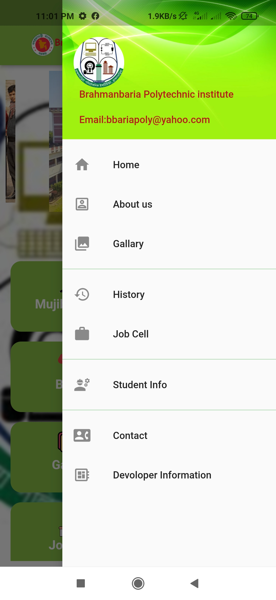
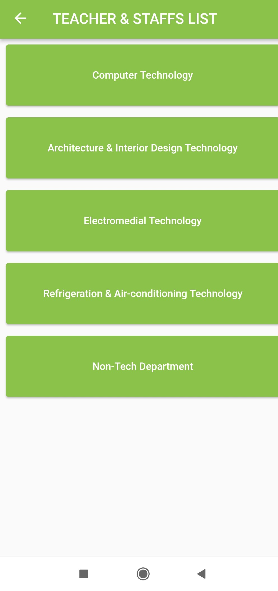
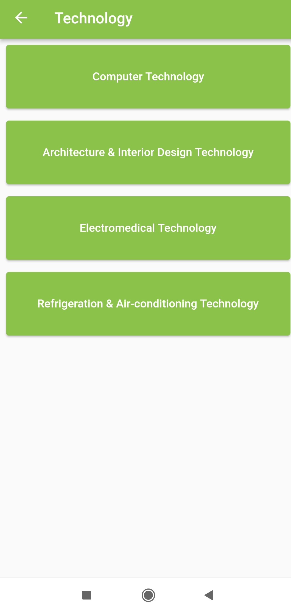
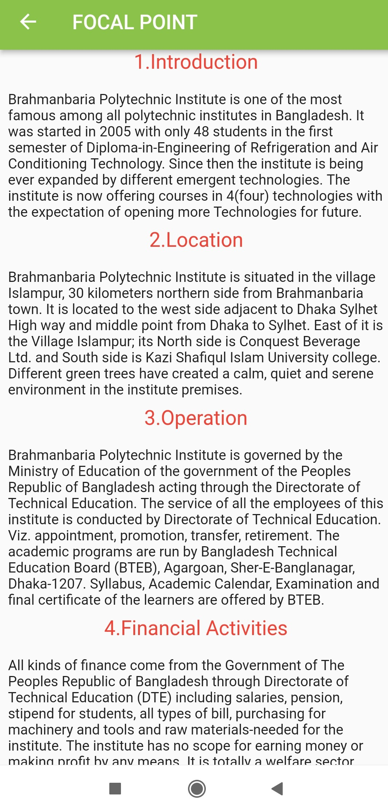
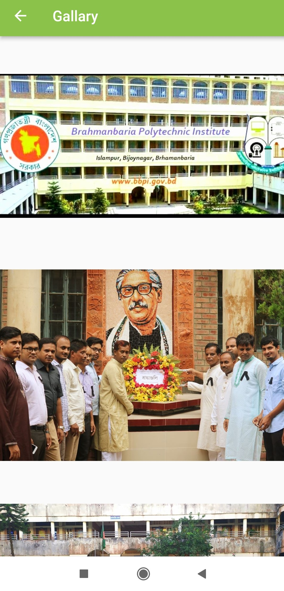
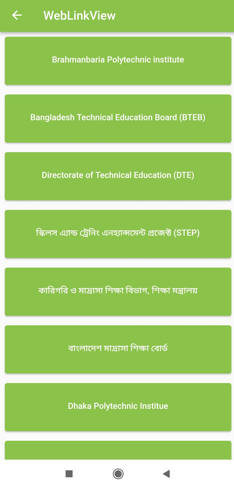
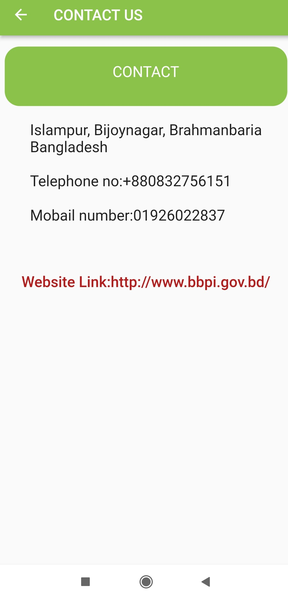
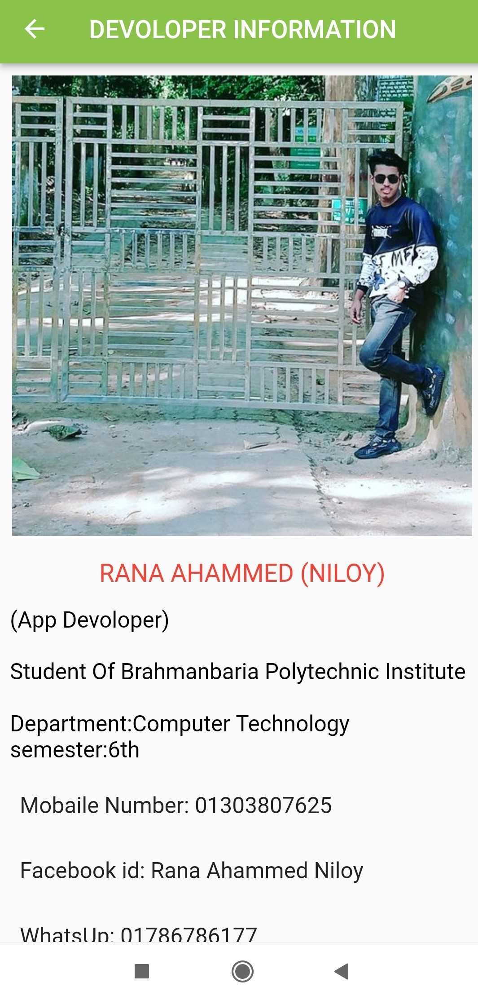

## BBPI

Collection of all Brahmanbaria Polytechnic Institute information.Teacher list,Teacher information,Technology list,Technology Information,Important website Link,job cell,Gallary,contact us,about us,mujib corner,Administration,Focal point etc.

## Features

 - Find Brahmanbaria polytechnic institute all information.
 - Explorer websites of all education departments education board etc.
 - Read & download all curricular books from NCTB's website
 - Websites of all education board are listed here as well as Bangladesh Technical Education  Board(BTEB).
 - Clean & Modern User Interface
 - Open your desired website just in one click.
 - Full Bangla UI & it's easy to use
 - and a bunch of usefull features

## Screenshots

   

<!-- 

 -->

## Try out BBPI?

Android: [Download BBPI.apk](https://github.com/ranaahammed165200/bbpi_college/raw/master/apk/app-release.apk)

## Developer

Hi there! I am Rana Ahammed Niloy . I create Android apps for solving problems and to make things easier. Try out my new app BBPI. If you have any query related to it don't hasitate to [e-mail me](mailto:ranaahammed165200@gmail.com). And also check out my other stuffs [Clik here](https://github.com/ranaahammed165200/bbpi_college.git)

### Note
 <small>BBPI contains links of external websites inside it. Note that these external sites are not operated by us. Therefore, we strongly advise you to review the Privacy Policy of these websites. We have no control over and assume no responsibility for the content, privacy policies, or practices of any third-party sites or services.</small>
